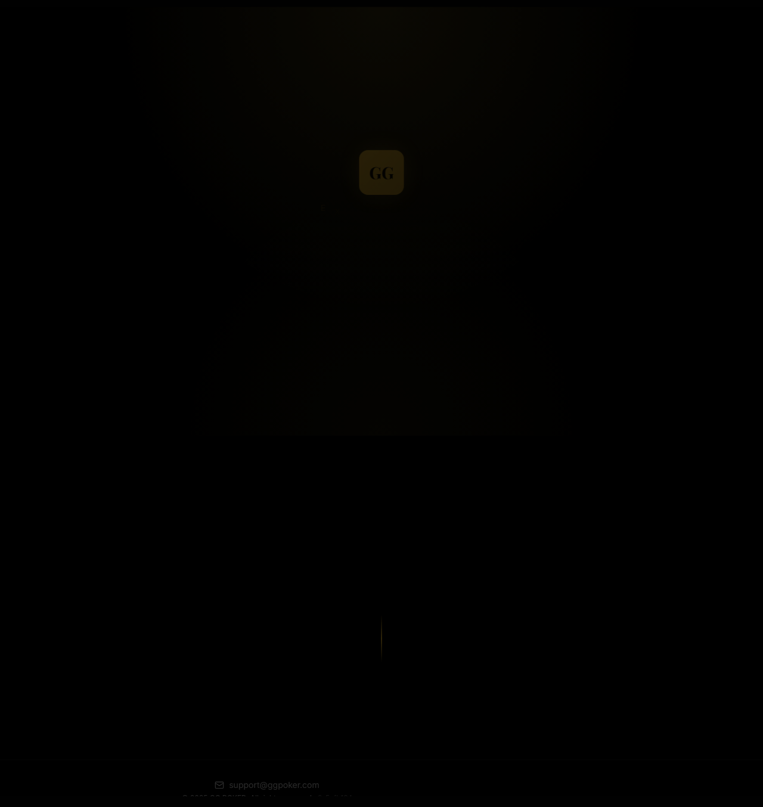

# Design Comparison: Current vs New

GGP Heritage Mall 디자인 시스템 비교 문서

## 1. 테마 방향

| 항목 | 현재 디자인 (Dark Mode) | 새 디자인 (Light Mode) |
|------|------------------------|----------------------|
| **배경색** | `#050505` (럭셔리 블랙) | `#FAFAFA` (스톤 라이트) |
| **표면색** | `#151515` | `#FFFFFF` |
| **테두리** | `#2a2a2a` | `#e5e5e5` |
| **스크롤바** | 다크 테마 | 호버 시 골드 (#C5A059) |

---

## 2. 색상 시스템 비교

### 2.1 골드 팔레트

| 토큰 | 현재 | 새 디자인 | 변화 |
|------|------|----------|-----|
| **Primary Gold** | `#d4af37` | `#C5A059` | 차분하고 세련된 톤 |
| **Gold Dark** | `#b8962f` | `#947638` | 더 어두운 악센트 |
| **Gold Light** | - | `#E0C895` | **신규** |

### 2.2 텍스트 색상

| 용도 | 현재 | 새 디자인 |
|------|------|----------|
| **주요 텍스트** | `#ffffff` | `#0A0A0A` (럭셔리 블랙) |
| **보조 텍스트** | `#a0a0a0` | `#333333` (럭셔리 차콜) |
| **음소거 텍스트** | `#666666` | `#9ca3af` |

### 2.3 신규 색상

| 토큰 | 값 | 용도 |
|------|-----|-----|
| **Platinum** | `#F5F5F7` | Platinum 티어 배경 |
| **Stone Light** | `#FAFAFA` | 페이지 배경 |
| **Luxury Charcoal** | `#333333` | 보조 텍스트 |

---

## 3. 타이포그래피 비교

### 3.1 폰트 패밀리

| 용도 | 현재 | 새 디자인 |
|------|------|----------|
| **헤딩** | Playfair Display | Playfair Display (유지) |
| **본문** | Inter | **Montserrat** |
| **럭셔리 강조** | - | **Cormorant Garamond** (신규) |
| **모던 산세리프** | - | **Manrope** (신규) |

### 3.2 Letter Spacing

| 토큰 | 현재 | 새 디자인 |
|------|------|----------|
| **기본** | 기본값 | `0.2em` (widest-luxury) |
| **강조** | - | `0.25em` (widest-xl) |
| **최대** | - | `0.35em` (widest-2xl) |

---

## 4. Shadow 시스템 비교

### 4.1 현재 Shadow

```css
/* 기본 카드 호버 */
box-shadow: 0 10px 40px rgba(0, 0, 0, 0.3);

/* 골드 글로우 */
.glow-gold: 0 0 20px var(--color-gold), 0 0 40px rgba(212, 175, 55, 0.3);
```

### 4.2 새 Shadow 시스템

| 이름 | 값 | 용도 |
|------|-----|-----|
| **Glow** | `0 0 100px -20px rgba(197, 160, 89, 0.15)` | 골드 빛 배경 |
| **Sharp** | `0 0 0 1px rgba(0,0,0,0.03), 0 30px 60px -15px rgba(0,0,0,0.08)` | 카드 경계 |
| **Elegant** | `0 2px 15px rgba(0,0,0,0.02)` | 미묘한 그림자 |
| **Pristine** | `0 20px 40px -10px rgba(0, 0, 0, 0.05)` | 깔끔한 카드 |

---

## 5. 컴포넌트 패턴 비교

### 5.1 Input 컴포넌트

**현재 디자인:**
```css
.input {
  border: 1px solid #2a2a2a;
  background: #151515;
  border-radius: 4px;
}
```

**새 디자인 (Floating Label):**
```css
.floating-input {
  border: none;
  border-bottom: 1px solid #e5e5e5;
  background: transparent;
  padding: 12px 0;
  transition: border-color 0.5s;
}

.floating-input:focus {
  border-bottom-color: #C5A059;
}

.floating-label {
  position: absolute;
  font-size: 10px;
  text-transform: uppercase;
  letter-spacing: 0.2em;
  transition: all 0.3s;
}
```

### 5.2 Card 컴포넌트

**현재 디자인:**
```css
.card-hover:hover {
  transform: translateY(-2px);
  box-shadow: 0 10px 40px rgba(0, 0, 0, 0.3);
}
```

**새 디자인:**
```css
.luxury-card {
  position: relative;
  box-shadow: 0 20px 40px -10px rgba(0, 0, 0, 0.05);
}

.luxury-card::before {
  content: '';
  position: absolute;
  top: 0;
  width: 100%;
  height: 2px;
  background: #0A0A0A;
  transform: scaleX(0);
  transition: transform 0.7s;
}

.luxury-card:hover {
  transform: translateY(-4px);
}

.luxury-card:hover::before {
  transform: scaleX(1);
}
```

### 5.3 Button 컴포넌트

**현재 디자인:**
- Primary: 골드 배경 + 다크 텍스트
- Secondary: 테두리만

**새 디자인:**
```css
.btn-luxury {
  position: relative;
  overflow: hidden;
  background: #0A0A0A;
  color: #fff;
  padding: 16px 40px;
  font-size: 11px;
  font-weight: 700;
  text-transform: uppercase;
  letter-spacing: 0.2em;
}

.btn-luxury::before {
  content: '';
  position: absolute;
  inset: 0;
  background: linear-gradient(to right, transparent, rgba(255,255,255,0.1), transparent);
  transform: translateX(-100%);
}

.btn-luxury:hover::before {
  transform: translateX(100%);
  transition: transform 1s;
}
```

---

## 6. 페이지별 변경 사항

### 6.1 Login Page
| 항목 | 현재 | 새 디자인 |
|------|------|----------|
| 레이아웃 | 중앙 폼 | 좌측 이미지 + 우측 폼 분할 |
| 입력 필드 | 테두리 박스 | Floating Label + 밑줄 |
| 배경 | 다크 솔리드 | 라이트 + 이미지 |

### 6.2 VIP Management Page
| 항목 | 현재 | 새 디자인 |
|------|------|----------|
| 통계 카드 | 기본 카드 | 상단 라인 애니메이션 |
| 테이블 | 기본 테이블 | 호버 시 그레이스케일 제거 |
| 필터 | 드롭다운 | 검색바 + 필터 버튼 |

### 6.3 Product Detail Page
| 항목 | 현재 | 새 디자인 |
|------|------|----------|
| 티어 배지 | Silver/Gold | + Platinum 추가 |
| 갤러리 | 단일 이미지 | 메인 + 썸네일 2개 |
| 사이즈 선택 | 드롭다운 | 라디오 버튼 스타일 |

### 6.4 Checkout Page
| 항목 | 현재 | 새 디자인 |
|------|------|----------|
| 배송 옵션 | 기본 | White Glove Concierge |
| 가격 표시 | 취소선만 | 금액 + VIP Benefit Applied |
| 완료 화면 | 텍스트 | 검증 아이콘 + 애니메이션 |

---

## 7. 신규 기능

### 7.1 White Glove Concierge
- 프리미엄 배송 서비스 표시
- 체크아웃 페이지에서 강조

### 7.2 대리석 배경 패턴
- Invite VIP 페이지에 대리석 무늬 오버레이
- 럭셔리 느낌 강화

---

## 8. 마이그레이션 체크리스트

### Phase 1: 색상 시스템
- [ ] CSS 변수 업데이트 (`globals.css`)
- [ ] 골드 색상 변경 (#d4af37 → #C5A059)
- [ ] 배경/표면 색상 반전 (다크 → 라이트)
- [ ] 텍스트 색상 반전

### Phase 2: 타이포그래피
- [ ] Montserrat 폰트 추가
- [ ] Cormorant Garamond 폰트 추가
- [ ] Letter Spacing 토큰 추가
- [ ] 본문 폰트 Inter → Montserrat 변경

### Phase 3: Shadow 시스템
- [ ] glow, sharp, elegant, pristine 토큰 추가
- [ ] 기존 box-shadow 교체

### Phase 4: 컴포넌트 업데이트
- [ ] Input 컴포넌트: Floating Label 패턴
- [ ] Card 컴포넌트: 상단 라인 애니메이션
- [ ] Button 컴포넌트: 광택 효과

### Phase 5: 페이지 업데이트
- [ ] Login 페이지 레이아웃 변경
- [ ] VIP Management 테이블 스타일
- [ ] Product Detail 갤러리 구조
- [ ] Checkout White Glove 배송

### Phase 6: 신규 기능
- [ ] 티어별 배지 컴포넌트 (Silver/Gold)
- [ ] 대리석 배경 패턴 CSS

---

## 9. 현재 디자인 (Dark Mode)

현재 구현된 GGP Heritage Mall 디자인입니다.

### 9.1 Admin Login (현재)


### 9.2 Home (현재)


### 9.3 Products (현재)


---

## 10. 새 디자인 목업 (Light Mode)

아래는 새로운 Light Mode 디자인 목업입니다.

> **주의**: 목업 이미지는 `stitch/` 프로젝트에서 생성된 디자인 참조용입니다.
> 목업의 브랜드명(VIP LOUNGE, GGP Heritage), 티어명(Diamond/Platinum), 상품 카테고리(Leather Goods 등)는 **무시**하세요.
> 실제 구현 시: **GG POKER**, **Silver/Gold 티어**, **Accessories/Apparel/Electronics/Lifestyle** 사용

### 10.1 Login Page (신규)


### 10.2 VIP Management (신규)


### 10.3 Invite VIP (신규)


### 10.4 Edit VIP (신규)


### 10.5 VIP Lounge (신규)


### 10.6 Product Detail (신규)


### 10.7 Checkout (신규)


---

## 11. 참조 파일

| 파일 | 용도 |
|------|------|
| `stitch/pages/*.tsx` | 페이지별 디자인 패턴 **(디자인만 참조)** |
| `web/src/app/globals.css` | 현재 CSS 변수 |
| `docs/DESIGN_TOKENS.md` | 디자인 토큰 상세 |

> **stitch 폴더 참조 시 주의**:
> stitch는 Google AI Studio로 생성된 별도 프로젝트입니다.
> **레이아웃, 컴포넌트 스타일, 색상만 참조**하고,
> 브랜드명, 티어명, 상품 카테고리는 무시하세요.
