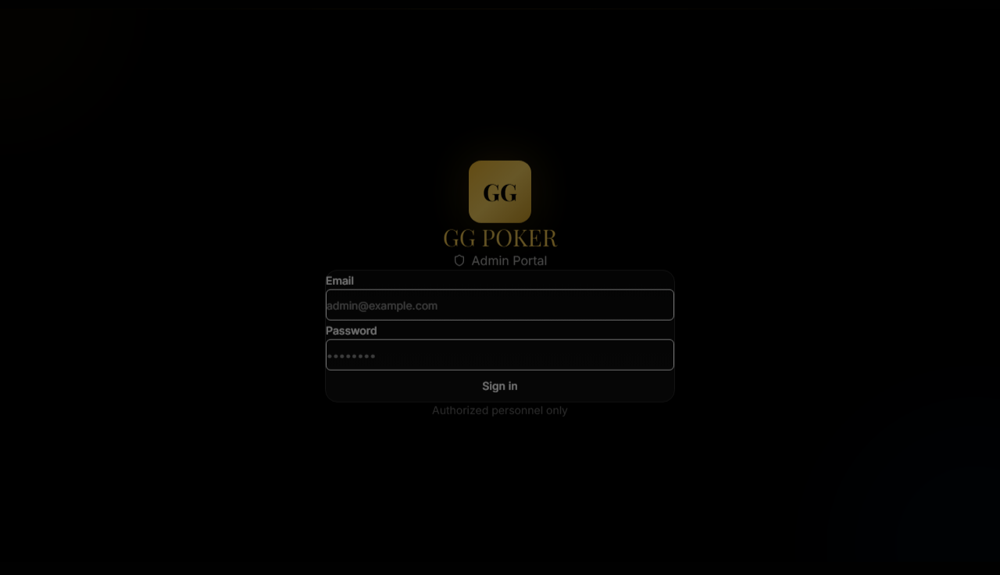
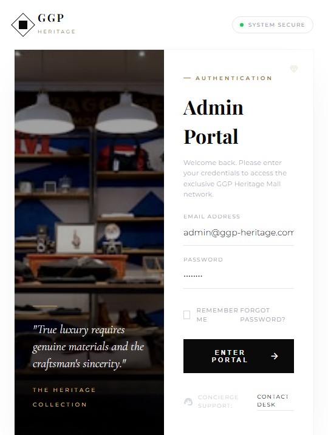

# PRD-0001: GGP Heritage Mall 디자인 마이그레이션

**Version**: 1.0.0
**Date**: 2025-12-25
**Status**: Draft
**Priority**: P1
**Author**: Product Team

---

## 1. 개요

### 1.1 프로젝트 목표

GGP Heritage Mall의 전체 디자인 시스템을 **Dark Mode에서 Light Mode**로 전환하고, **럭셔리 부티크** 스타일의 UI/UX를 적용합니다.

### 1.2 범위

| 카테고리 | 페이지 수 | 상세 |
|----------|----------|------|
| Admin 페이지 | 6개 | Login, Dashboard, VIP List/New/Edit, Orders |
| VIP 고객 페이지 | 5개 | Products, Product Detail, Checkout, Complete, Orders |
| **총계** | **11개** | |

### 1.3 관련 문서

| 문서 | 설명 |
|------|------|
| `PRD-0002-design-admin.md` | Admin 페이지 상세 설계 |
| `PRD-0003-design-vip.md` | VIP 고객 페이지 상세 설계 |
| `docs/DESIGN_COMPARISON.md` | 현재 vs 새 디자인 비교 |
| `docs/DESIGN_TOKENS.md` | 디자인 토큰 상세 |

---

## 2. 디자인 시스템 변경

### 2.1 테마 전환

| 항목 | 현재 (Dark) | 신규 (Light) |
|------|-------------|--------------|
| **배경색** | `#050505` | `#FAFAFA` |
| **표면색** | `#151515` | `#FFFFFF` |
| **테두리** | `#2a2a2a` | `#e5e5e5` |
| **주요 텍스트** | `#FFFFFF` | `#0A0A0A` |
| **보조 텍스트** | `#a0a0a0` | `#333333` |

### 2.2 골드 팔레트

| 토큰 | 현재 | 신규 | 변화 |
|------|------|------|------|
| Primary | `#D4AF37` | `#C5A059` | 더 차분하고 세련된 톤 |
| Dark | `#B8962F` | `#947638` | 깊이 있는 악센트 |
| Light | - | `#E0C895` | **신규 추가** |

### 2.3 타이포그래피

| 용도 | 현재 | 신규 |
|------|------|------|
| 헤딩 | Playfair Display | Playfair Display (유지) |
| 본문 | Inter | **Montserrat** |
| 럭셔리 강조 | - | **Cormorant Garamond** (신규) |

### 2.4 Shadow 시스템

| 토큰 | 값 | 용도 |
|------|-----|------|
| `shadow-glow` | `0 0 100px -20px rgba(197, 160, 89, 0.15)` | 골드 글로우 배경 |
| `shadow-sharp` | `0 0 0 1px rgba(0,0,0,0.03), 0 30px 60px -15px rgba(0,0,0,0.08)` | 선명한 카드 |
| `shadow-elegant` | `0 2px 15px rgba(0,0,0,0.02)` | 미묘한 깊이 |
| `shadow-pristine` | `0 20px 40px -10px rgba(0, 0, 0, 0.05)` | 깔끔한 카드 |

### 2.5 Letter Spacing

| 토큰 | 값 | 용도 |
|------|-----|------|
| `tracking-widest-luxury` | `0.2em` | 럭셔리 라벨 |
| `tracking-widest-xl` | `0.25em` | 대문자 헤딩 |
| `tracking-widest-2xl` | `0.35em` | 브랜드 로고 |

---

## 3. 컴포넌트 패턴 변경

### 3.1 Input 컴포넌트

**현재**: 테두리 박스 스타일
```css
border: 1px solid #2a2a2a;
background: #151515;
border-radius: 4px;
```

**신규**: Floating Label + Underline
```css
border: none;
border-bottom: 1px solid #e5e5e5;
background: transparent;
/* 포커스 시 골드 underline 애니메이션 */
```

### 3.2 Card 컴포넌트

**현재**: 기본 호버 효과
```css
transform: translateY(-2px);
box-shadow: 0 10px 40px rgba(0, 0, 0, 0.3);
```

**신규**: 상단 라인 애니메이션
```css
/* ::before pseudo-element */
height: 2px;
background: #0A0A0A;
transform: scaleX(0) → scaleX(1); /* 호버 시 */
```

### 3.3 Button 컴포넌트

**신규 Luxury Variant**:
- 배경: `#0A0A0A` (블랙)
- 텍스트: 대문자 + `letter-spacing: 0.2em`
- 호버: 광택 이동 효과 (`::before` translate)

---

## 4. 페이지별 변경 요약

### 4.1 Admin 페이지

| 페이지 | 주요 변경 |
|--------|----------|
| Login | 좌우 분할 레이아웃 (이미지 + 폼) |
| Dashboard | 통계 카드 상단 라인 애니메이션 |
| VIP List | 테이블 호버 효과, 프로필 컬러화 |
| VIP New | Floating Label 입력, 티어 카드 선택 |
| VIP Edit | 멤버십 티어 시각화, 활동 통계 |
| Orders | 상태 배지 리디자인 |

### 4.2 VIP 고객 페이지

| 페이지 | 주요 변경 |
|--------|----------|
| Products (Lounge) | 히어로 배너 + 카테고리 탭 |
| Product Detail | 갤러리 + 티어 권한 배지 |
| Checkout | 단계 표시 + VIP Benefit 강조 |
| Complete | 확인 애니메이션 |
| Orders | 주문 카드 리디자인 |

---

## 5. 마이그레이션 계획

### Phase 1: 디자인 토큰 (Week 1)

- [ ] `globals.css` CSS 변수 업데이트
- [ ] Tailwind 설정에 커스텀 토큰 추가
- [ ] 폰트 추가 (Montserrat, Cormorant Garamond)

### Phase 2: 공통 컴포넌트 (Week 2)

- [ ] `FloatingInput` 컴포넌트 생성
- [ ] `LuxuryCard` 컴포넌트 생성
- [ ] `Button` luxury variant 추가
- [ ] `Badge` 리디자인

### Phase 3: Admin 페이지 (Week 3-4)

- [ ] Login 페이지 레이아웃 변경
- [ ] Dashboard 통계 카드
- [ ] VIP 관리 페이지들

### Phase 4: VIP 고객 페이지 (Week 5-6)

- [ ] Products (Lounge) 페이지
- [ ] Product Detail
- [ ] Checkout 플로우

### Phase 5: QA & 최적화 (Week 7)

- [ ] 반응형 테스트
- [ ] 접근성 검증
- [ ] 성능 최적화

---

## 6. 기술 요구사항

### 6.1 CSS 변수 구조

```css
:root {
  /* 배경 */
  --bg-primary: #FAFAFA;
  --bg-surface: #FFFFFF;
  --bg-muted: #F5F5F5;

  /* 텍스트 */
  --text-primary: #0A0A0A;
  --text-secondary: #333333;
  --text-muted: #9CA3AF;

  /* 골드 */
  --color-gold: #C5A059;
  --color-gold-light: #E0C895;
  --color-gold-dark: #947638;

  /* 테두리 */
  --border-default: #E5E5E5;
  --border-focus: var(--color-gold);

  /* Shadow */
  --shadow-pristine: 0 20px 40px -10px rgba(0, 0, 0, 0.05);
  --shadow-sharp: 0 0 0 1px rgba(0,0,0,0.03), 0 30px 60px -15px rgba(0,0,0,0.08);
}
```

### 6.2 신규 컴포넌트 목록

| 컴포넌트 | 파일 | 설명 |
|----------|------|------|
| `FloatingInput` | `components/ui/FloatingInput.tsx` | 밑줄 + 라벨 애니메이션 |
| `LuxuryCard` | `components/ui/LuxuryCard.tsx` | 상단 라인 애니메이션 |
| `TierBadge` | `components/ui/TierBadge.tsx` | Silver/Gold/Platinum 배지 |
| `StepIndicator` | `components/ui/StepIndicator.tsx` | 체크아웃 단계 표시 |

---

## 7. 목업 이미지

### 7.1 Admin 페이지

| 페이지 | 현재 | 신규 목업 |
|--------|------|----------|
| Login |  |  |

### 7.2 VIP 고객 페이지

| 페이지 | 현재 | 신규 목업 |
|--------|------|----------|
| Products |  |  |

---

## 8. 성공 지표

| 지표 | 목표 |
|------|------|
| 디자인 일관성 | 모든 페이지 동일 디자인 토큰 사용 |
| 접근성 | WCAG 2.1 AA 준수 |
| 성능 | LCP < 2.5s, CLS < 0.1 |
| 코드 품질 | 컴포넌트 재사용률 80% 이상 |

---

## 9. 위험 요소

| 위험 | 영향 | 대응 |
|------|------|------|
| 기존 스타일 충돌 | 중 | CSS 변수 점진적 교체 |
| 폰트 로딩 지연 | 저 | `font-display: swap` 적용 |
| 반응형 깨짐 | 중 | 모바일 우선 테스트 |

---

## 변경 이력

| 버전 | 날짜 | 변경 내용 |
|------|------|----------|
| 1.0.0 | 2025-12-25 | 초기 PRD 작성 |

---

**다음 문서**:
- [PRD-0002: Admin 페이지 상세](./PRD-0002-design-admin.md)
- [PRD-0003: VIP 고객 페이지 상세](./PRD-0003-design-vip.md)
