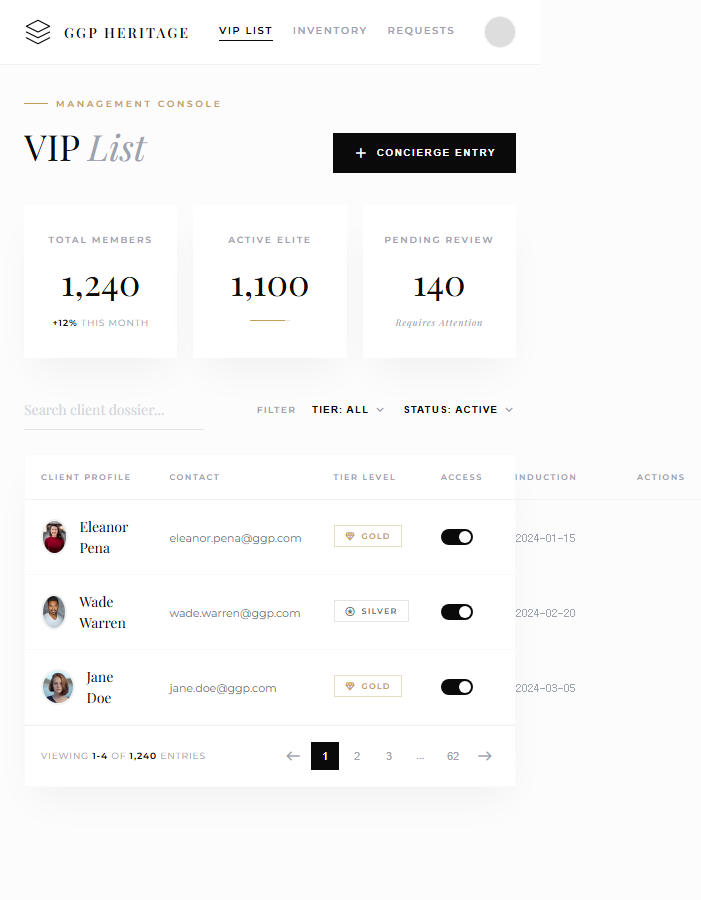
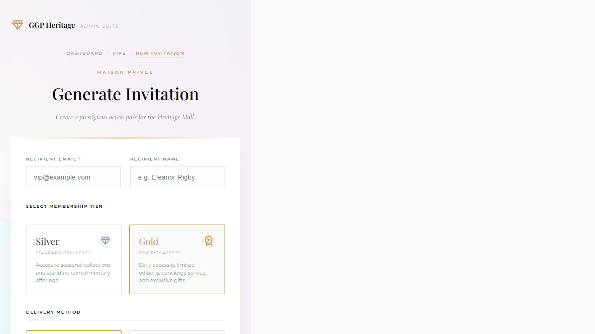
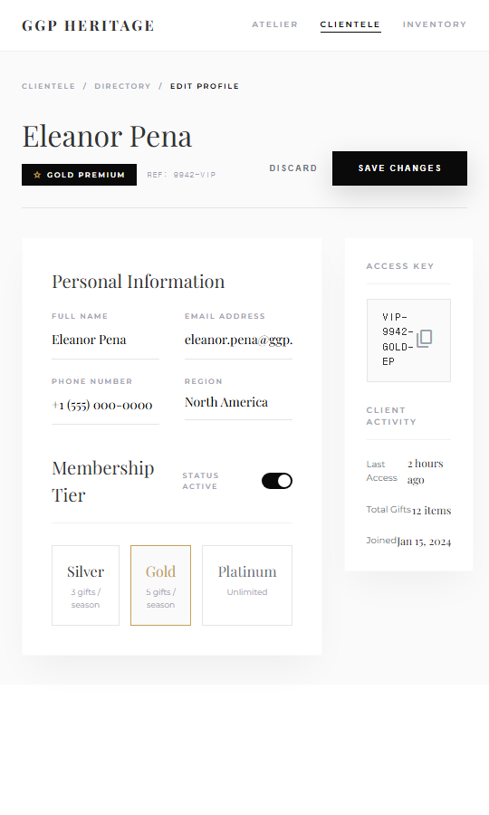

# PRD-0002: Admin 페이지 디자인 상세

**Version**: 1.1.0
**Date**: 2025-12-25
**Status**: Draft
**Priority**: P1
**Parent**: PRD-0001

---

## 1. 개요

Admin 영역의 6개 페이지에 대한 디자인 변경 상세 명세입니다.

> **주의**: 목업 이미지는 디자인 참조용입니다.
> 목업의 브랜드명(GGP Heritage), 티어명(Diamond/Platinum)은 무시하고,
> 실제 구현 시: **GG POKER**, **Silver/Gold 티어** 사용

### 1.1 대상 페이지

| 경로 | 페이지명 | 목업 |
|------|---------|------|
| `/admin/auth/login` | 관리자 로그인 | 01-login-page |
| `/admin/dashboard` | 대시보드 | 08-dashboard |
| `/admin/vips` | VIP 목록 | 02-vip-management |
| `/admin/vips/new` | VIP 생성 | 03-invite-vip |
| `/admin/vips/[id]/edit` | VIP 수정 | 04-edit-vip |
| `/admin/orders` | 주문 목록 | 09-admin-orders |

---

## 2. Admin Login 페이지

### 2.1 현재 디자인


**특징**:
- 중앙 정렬 단일 폼
- 다크 배경 (`#050505`)
- GG POKER 브랜딩
- 테두리 박스 입력 필드

### 2.2 신규 디자인


**특징**:
- 좌우 50:50 분할 레이아웃
- 좌측: 럭셔리 이미지 + 명언
- 우측: 로그인 폼
- **GG POKER 브랜딩 유지**

### 2.3 상세 변경 사항

| 요소 | 현재 | 신규 |
|------|------|------|
| **레이아웃** | 중앙 정렬 | 좌우 분할 (이미지 + 폼) |
| **배경** | `#050505` (다크) | `#FFFFFF` (라이트) |
| **로고** | GG POKER 아이콘 | GG POKER 아이콘 (유지) |
| **입력 필드** | 테두리 박스 | Floating Label + 밑줄 |
| **버튼** | "Sign in" (회색) | "ENTER PORTAL" (블랙, 대문자) |
| **추가 요소** | 없음 | 명언 인용구, 시스템 상태 배지 |

### 2.4 컴포넌트 명세

#### 2.4.1 좌측 이미지 패널

```tsx
<div className="relative w-1/2 bg-black overflow-hidden">
  {/* 배경 이미지 */}
  <div
    className="absolute inset-0 bg-cover bg-center opacity-85"
    style={{ backgroundImage: 'url(...)' }}
  />

  {/* 그라데이션 오버레이 */}
  <div className="absolute inset-0 bg-gradient-to-t from-black/90 via-black/20 to-black/30" />

  {/* 명언 */}
  <div className="absolute bottom-10 left-8 right-8 text-white">
    <div className="w-10 h-px bg-gold mb-6" />
    <p className="font-cormorant text-xl italic">
      "True luxury requires genuine materials and the craftsman's sincerity."
    </p>
    <span className="text-xs tracking-widest-2xl text-gold-light">
      THE HERITAGE COLLECTION
    </span>
  </div>
</div>
```

#### 2.4.2 우측 폼 패널

```tsx
<div className="w-1/2 p-10 flex flex-col justify-center">
  {/* 헤더 */}
  <div className="mb-8">
    <div className="flex items-center gap-2 mb-4">
      <div className="w-3 h-px bg-gold-dark" />
      <span className="text-xs tracking-widest-2xl text-gold-dark font-bold">
        AUTHENTICATION
      </span>
    </div>
    <h2 className="font-playfair text-4xl">Admin Portal</h2>
    <p className="text-sm text-muted mt-3">
      Welcome back. Please enter your credentials...
    </p>
  </div>

  {/* 폼 */}
  <form>
    <FloatingInput label="Email Address" type="email" />
    <FloatingInput label="Password" type="password" />

    <div className="flex justify-between items-center mb-6">
      <Checkbox label="Remember Me" />
      <a className="text-xs tracking-wide text-muted">Forgot Password?</a>
    </div>

    <Button variant="luxury" className="w-full">
      ENTER PORTAL
      <ArrowRight className="ml-2" />
    </Button>
  </form>

  {/* 푸터 */}
  <div className="mt-8 text-xs text-muted flex items-center gap-2">
    <HeadsetIcon />
    Concierge Support: <a className="text-black border-b">Contact Desk</a>
  </div>
</div>
```

### 2.5 반응형 동작

| 브레이크포인트 | 동작 |
|--------------|------|
| Desktop (1024px+) | 좌우 분할 50:50 |
| Tablet (768px-1023px) | 이미지 40%, 폼 60% |
| Mobile (< 768px) | 이미지 숨김, 폼만 전체 표시 |

---

## 3. Dashboard 페이지

### 3.1 신규 디자인 방향

기존 대시보드 구조 유지, 스타일만 변경

### 3.2 통계 카드

**현재**: 기본 카드
**신규**: LuxuryCard (상단 라인 애니메이션)

```tsx
<div className="grid grid-cols-3 gap-4">
  <LuxuryCard>
    <p className="text-xs tracking-widest text-muted font-bold">
      TOTAL MEMBERS
    </p>
    <p className="font-playfair text-4xl">1,240</p>
    <p className="text-xs text-muted mt-2">
      <strong className="text-black">+12%</strong> THIS MONTH
    </p>
  </LuxuryCard>

  <LuxuryCard accentColor="gold">
    <p className="text-xs tracking-widest text-muted font-bold">
      ACTIVE ELITE
    </p>
    <p className="font-playfair text-4xl">1,100</p>
    {/* 프로그레스 바 */}
    <div className="w-10 h-px bg-gray-200 mt-3">
      <div className="w-[88%] h-full bg-gold" />
    </div>
  </LuxuryCard>

  <LuxuryCard>
    <p className="text-xs tracking-widest text-muted font-bold">
      PENDING REVIEW
    </p>
    <p className="font-playfair text-4xl">140</p>
    <p className="font-playfair italic text-xs text-muted mt-2">
      Requires Attention
    </p>
  </LuxuryCard>
</div>
```

---

## 4. VIP 목록 페이지

### 4.1 현재 디자인

(스크린샷 없음 - 기본 다크 테이블)

### 4.2 신규 디자인



### 4.3 상세 변경 사항

| 요소 | 현재 | 신규 |
|------|------|------|
| **헤더** | 기본 | "VIP *List*" (이탤릭 강조) |
| **통계** | 없음 | 3개 LuxuryCard |
| **검색** | 기본 input | Floating label 스타일 |
| **필터** | 드롭다운 | 인라인 버튼 + 드롭다운 |
| **테이블** | 기본 테이블 | 호버 시 배경 변경, 아바타 컬러화 |
| **액션** | 항상 표시 | 호버 시 표시 |

### 4.4 테이블 Row 컴포넌트

```tsx
<tr className="group border-b border-gray-50 hover:bg-gray-50/50">
  {/* 프로필 */}
  <td className="p-4">
    <div className="flex items-center gap-3">
      <div className="w-9 h-9 rounded-full border-2 border-gray-100 overflow-hidden">
        
      </div>
      <span className="font-playfair">{name}</span>
    </div>
  </td>

  {/* 이메일 */}
  <td className="p-4 text-sm text-gray-500">{email}</td>

  {/* 티어 배지 */}
  <td className="p-4">
    <TierBadge tier={tier} />
  </td>

  {/* 토글 */}
  <td className="p-4">
    <Toggle checked={isActive} />
  </td>

  {/* 날짜 */}
  <td className="p-4 text-sm font-mono text-muted">{date}</td>

  {/* 액션 (호버 시 표시) */}
  <td className="p-4">
    <div className="opacity-0 group-hover:opacity-100 flex gap-1 justify-end">
      <IconButton icon={<EditNote />} />
      <IconButton icon={<Delete />} variant="danger" />
    </div>
  </td>
</tr>
```

### 4.5 TierBadge 컴포넌트

```tsx
const tierStyles = {
  gold: 'border-amber-200 text-gold',
  silver: 'border-gray-200 text-gray-500',
};

<span className={`
  inline-flex items-center gap-1.5
  px-2.5 py-1
  border text-xs font-bold tracking-wide uppercase
  ${tierStyles[tier]}
`}>
  <DiamondIcon className="w-3 h-3" />
  {tier.toUpperCase()}
</span>
```

---

## 5. VIP 생성 페이지 (Invite)

### 5.1 신규 디자인



### 5.2 상세 변경 사항

| 요소 | 현재 | 신규 |
|------|------|------|
| **헤더** | "새 VIP 추가" | "Generate Invitation" + 부제 |
| **브레드크럼** | 없음 | DASHBOARD / VIPS / NEW INVITATION |
| **입력 필드** | 테두리 박스 | 라운드 테두리 + 라벨 위 |
| **티어 선택** | 라디오 버튼 | 카드 선택 (설명 포함) |
| **배송 방법** | 없음 | Email / SMS 선택 |

### 5.3 티어 선택 카드

```tsx
<div className="grid grid-cols-2 gap-4">
  <TierSelectCard
    tier="silver"
    title="Silver"
    subtitle="STANDARD PRIVILEGES"
    description="Access to seasonal collections and standard complimentary offerings. Up to 3 items per season."
    selected={selectedTier === 'silver'}
    onClick={() => setSelectedTier('silver')}
  />

  <TierSelectCard
    tier="gold"
    title="Gold"
    subtitle="PRIORITY ACCESS"
    description="Early access to limited editions, concierge service, and exclusive gifts. Up to 5 items per season."
    selected={selectedTier === 'gold'}
    onClick={() => setSelectedTier('gold')}
  />
</div>
```

---

## 6. VIP 수정 페이지

### 6.1 신규 디자인



### 6.2 상세 변경 사항

| 요소 | 현재 | 신규 |
|------|------|------|
| **헤더** | 이메일만 | 이름 + 배지 + REF 코드 |
| **섹션** | 단일 폼 | Personal / Membership / Access Key 분리 |
| **티어 표시** | 라디오 | 2개 카드 (Silver/Gold) |
| **활동 정보** | 없음 | Last Access, Total Gifts, Joined 표시 |

### 6.3 레이아웃 구조

```tsx
<div className="grid grid-cols-3 gap-8">
  {/* 좌측: Personal Info + Membership */}
  <div className="col-span-2 space-y-8">
    <Section title="Personal Information">
      <div className="grid grid-cols-2 gap-4">
        <DisplayField label="FULL NAME" value={name} />
        <DisplayField label="EMAIL ADDRESS" value={email} />
        <DisplayField label="PHONE NUMBER" value={phone} />
        <DisplayField label="REGION" value={region} />
      </div>
    </Section>

    <Section title="Membership Tier">
      <div className="flex items-center gap-4 mb-6">
        <span>Status</span>
        <Toggle checked={isActive} label="ACTIVE" />
      </div>

      <div className="grid grid-cols-2 gap-3">
        <TierCard tier="silver" limit="3 gifts / season" />
        <TierCard tier="gold" limit="5 gifts / season" selected />
      </div>
    </Section>
  </div>

  {/* 우측: Access Key + Activity */}
  <div className="space-y-8">
    <Section title="ACCESS KEY">
      <div className="border p-4 font-mono text-sm">
        VIP-9942-GOLD-EP
        <CopyButton />
      </div>
    </Section>

    <Section title="CLIENT ACTIVITY">
      <ActivityItem label="Last Access" value="2 hours ago" />
      <ActivityItem label="Total Gifts" value="12 items" />
      <ActivityItem label="Joined" value="Jan 15, 2024" />
    </Section>
  </div>
</div>
```

---

## 7. 주문 목록 페이지

### 7.1 변경 방향

VIP 목록과 동일한 디자인 패턴 적용

### 7.2 주요 변경

| 요소 | 현재 | 신규 |
|------|------|------|
| **헤더** | "주문 관리" | "Order *Registry*" |
| **통계** | 없음 | 3개 LuxuryCard (총 주문, 처리중, 완료) |
| **테이블** | 기본 | VIP 목록과 동일 스타일 |
| **상태 배지** | 컬러 배지 | 아웃라인 배지 + 아이콘 |

---

## 8. 공통 컴포넌트

### 8.1 AdminLayout 변경

```tsx
<div className="min-h-screen bg-stone-light">
  {/* 헤더 */}
  <header className="bg-white/95 border-b border-gray-100 backdrop-blur">
    <div className="flex items-center justify-between px-6 py-4">
      <div className="flex items-center gap-3">
        <Logo />
        <span className="font-playfair text-sm tracking-wide">
          GG POKER
        </span>
      </div>

      <nav className="flex gap-5 text-xs font-semibold tracking-wide uppercase">
        <NavLink href="/admin/vips" active>VIP List</NavLink>
        <NavLink href="/admin/orders">Inventory</NavLink>
        <NavLink href="/admin/requests">Requests</NavLink>
      </nav>

      <Avatar />
    </div>
  </header>

  {/* 메인 콘텐츠 */}
  <main className="p-8">
    {children}
  </main>
</div>
```

### 8.2 Sidebar 제거

신규 디자인에서는 상단 네비게이션으로 전환

---

## 9. 구현 우선순위

| 순서 | 페이지 | 난이도 |
|------|--------|-------|
| 1 | Login | 중 |
| 2 | VIP 목록 | 상 |
| 3 | VIP 생성 | 중 |
| 4 | VIP 수정 | 중 |
| 5 | Dashboard | 저 |
| 6 | 주문 목록 | 저 |

---

## 변경 이력

| 버전 | 날짜 | 변경 내용 |
|------|------|----------|
| 1.0.0 | 2025-12-25 | 초기 PRD 작성 |
| 1.1.0 | 2025-12-25 | 브랜드(GG POKER) 명확화, Platinum 티어 제거, 목업 참조 주의사항 추가 |

---

**다음 문서**: [PRD-0003: VIP 고객 페이지 상세](./PRD-0003-design-vip.md)
