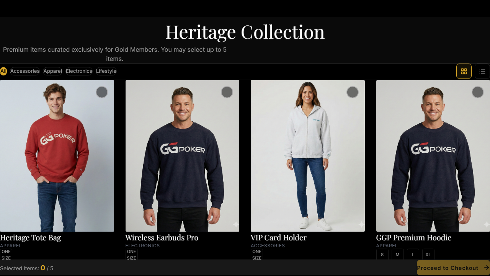
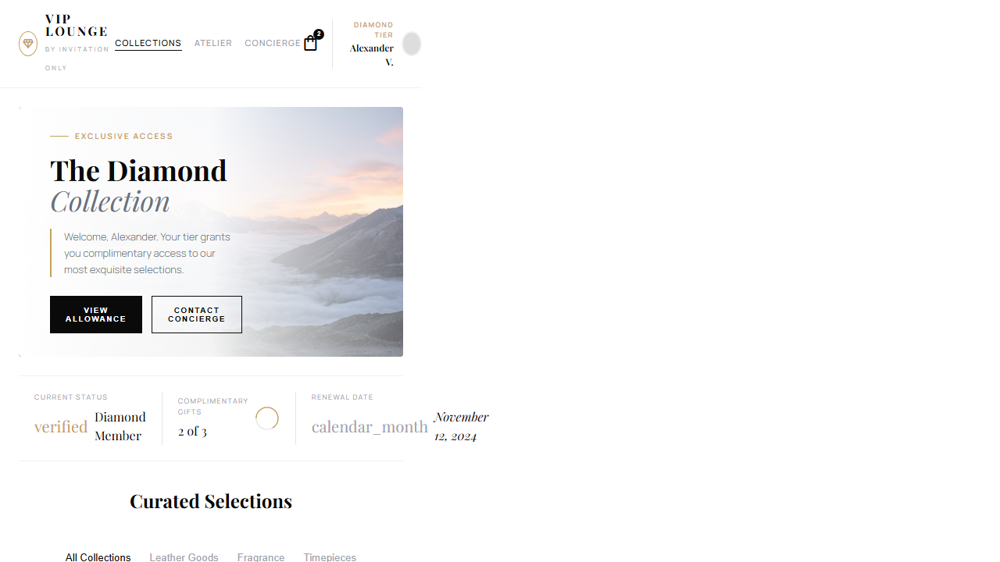
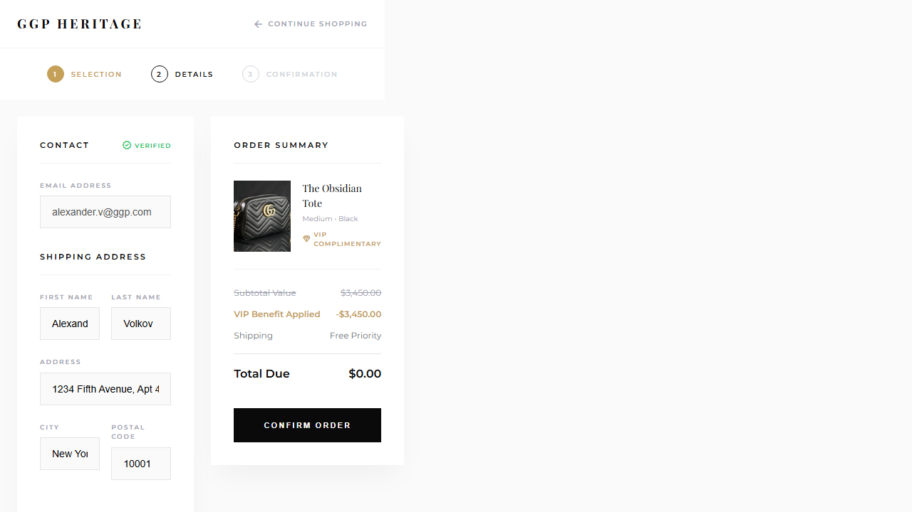

# PRD-0003: VIP 고객 페이지 디자인 상세

**Version**: 1.1.0
**Date**: 2025-12-25
**Status**: Draft
**Priority**: P1
**Parent**: PRD-0001

---

## 1. 개요

VIP 고객이 사용하는 5개 페이지에 대한 디자인 변경 상세 명세입니다.

> **주의**: 목업 이미지는 디자인 참조용입니다.
> 목업의 브랜드명(VIP LOUNGE), 티어명(Diamond/Platinum), 상품 카테고리(Leather Goods 등)는 무시하고,
> 실제 구현 시: **GG POKER**, **Silver/Gold 티어**, **Accessories/Apparel/Electronics/Lifestyle** 사용

### 1.1 대상 페이지

| 경로 | 페이지명 | 목업 |
|------|---------|------|
| `/products` | 상품 목록 (Heritage Collection) | 05-vip-lounge |
| `/products/[id]` | 상품 상세 | 06-product-detail |
| `/checkout` | 체크아웃 | 07-checkout |
| `/checkout/complete` | 주문 완료 | 10-checkout-complete |
| `/orders` | 주문 내역 | - |

---

## 2. Products 페이지 (Heritage Collection)

### 2.1 현재 디자인



**특징**:
- "Heritage Collection" 헤더
- 다크 배경 (`#000`)
- 4열 상품 그리드
- 카테고리 필터 (All, Accessories, Apparel...)
- 하단 "Selected Items: 0/5" 표시

### 2.2 신규 디자인



**특징** (목업 디자인 참조, 실제 값은 다름):
- "Heritage Collection" 헤더 (유지)
- 라이트 배경 + 히어로 이미지
- VIP 정보 표시 (**Gold/Silver Tier**, 이름)
- 상품 카테고리 (**Accessories, Apparel, Electronics, Lifestyle**)

### 2.3 상세 변경 사항

| 요소 | 현재 | 신규 |
|------|------|------|
| **브랜드** | "Heritage Collection" | "Heritage Collection" (유지) |
| **배경** | 다크 (`#000`) | 라이트 + 히어로 이미지 |
| **VIP 정보** | "Selected Items: 0/5" | Gold/Silver Tier + 이름 + "2 of 3" (Silver) 또는 "3 of 5" (Gold) |
| **카테고리** | Accessories/Apparel/Electronics/Lifestyle | 동일 (유지) |
| **상품 카드** | 실제 상품 사진 | 동일, 스타일만 변경 |
| **네비게이션** | 없음 | COLLECTIONS/SHOP/CONCIERGE |

### 2.4 히어로 섹션

```tsx
<section className="relative h-[400px] overflow-hidden">
  {/* 배경 이미지 */}
  <div
    className="absolute inset-0 bg-cover bg-center"
    style={{ backgroundImage: 'url(/images/hero-landscape.jpg)' }}
  />

  {/* 그라데이션 */}
  <div className="absolute inset-0 bg-gradient-to-r from-white/90 via-white/60 to-transparent" />

  {/* 콘텐츠 */}
  <div className="relative z-10 h-full flex flex-col justify-center px-12">
    <div className="flex items-center gap-2 mb-4">
      <div className="w-8 h-px bg-gold" />
      <span className="text-xs tracking-widest-xl text-gold font-bold">
        EXCLUSIVE ACCESS
      </span>
    </div>

    <h1 className="font-playfair text-5xl mb-2">
      Heritage
    </h1>
    <p className="font-playfair text-4xl text-muted italic">
      Collection
    </p>

    <div className="mt-6 border-l-2 border-gold pl-4">
      <p className="text-sm text-secondary max-w-xs">
        Welcome, {vipName}. Your {tier} tier grants you complimentary access
        to our exclusive selections.
      </p>
    </div>

    <div className="flex gap-3 mt-8">
      <Button variant="luxury">VIEW ALLOWANCE</Button>
      <Button variant="outline-luxury">CONTACT CONCIERGE</Button>
    </div>
  </div>
</section>
```

### 2.5 VIP 상태 바

```tsx
<div className="flex items-center justify-between py-4 border-y border-gray-100">
  <div className="flex items-center gap-8">
    <StatusItem
      label="CURRENT STATUS"
      value="verified"
      highlight={`${tier} Member`}  // "Gold Member" 또는 "Silver Member"
    />
    <StatusItem
      label="COMPLIMENTARY GIFTS"
      value={tier === 'gold' ? '3 of 5' : '2 of 3'}
      progress={tier === 'gold' ? 60 : 66}
    />
    <StatusItem
      label="RENEWAL DATE"
      value="November 12, 2024"
      icon={<CalendarIcon />}
    />
  </div>
</div>
```

### 2.6 카테고리 탭

```tsx
<div className="flex gap-8 border-b border-gray-100">
  <TabButton active>All</TabButton>
  <TabButton>Accessories</TabButton>
  <TabButton>Apparel</TabButton>
  <TabButton>Electronics</TabButton>
  <TabButton>Lifestyle</TabButton>
</div>
```

---

## 3. Product Detail 페이지

### 3.1 현재 디자인

- 단일 이미지
- 드롭다운 사이즈 선택
- "Proceed to Checkout" 버튼

### 3.2 신규 디자인


**특징** (목업 디자인 참조, 실제 값은 다름):
- 상단 "PRIVATE VIEWING - **GOLD TIER ACCESS ONLY**" 배너 (Gold 전용 상품인 경우)
- 메인 이미지 + 썸네일 2개
- **GOLD PRIVILEGE** 또는 **ALL MEMBERS** 배지
- 사이즈 버튼 (Small/Medium/Large 또는 ONE SIZE)
- "ADD TO BAG (COMPLIMENTARY)" 버튼

### 3.3 상세 변경 사항

| 요소 | 현재 | 신규 |
|------|------|------|
| **상단 배너** | 없음 | 티어 제한 안내 (Gold 전용 시) |
| **브랜드** | GG POKER | GG POKER (유지) |
| **이미지** | 단일 | 메인 + 썸네일 2개 |
| **설명** | 기본 텍스트 | 이탤릭 럭셔리 카피 |
| **티어 배지** | 없음 | GOLD PRIVILEGE 또는 ALL MEMBERS 박스 |
| **사이즈 선택** | 드롭다운 | 버튼 그룹 |
| **CTA** | "Proceed to Checkout" | "ADD TO BAG (COMPLIMENTARY)" |

### 3.4 레이아웃 구조

```tsx
<div className="min-h-screen bg-white">
  {/* 티어 배너 (Gold 전용 상품인 경우만 표시) */}
  {tierRequired === 'gold' && (
    <div className="bg-black text-white py-2 px-4 text-center">
      <span className="text-xs tracking-widest">
        PRIVATE VIEWING - <span className="text-gold">GOLD TIER ACCESS ONLY</span>
      </span>
    </div>
  )}

  {/* 헤더 */}
  <header className="flex items-center justify-between px-6 py-4 border-b">
    <span className="font-playfair text-xl tracking-widest">GG POKER</span>
    <div className="flex gap-4">
      <SearchIcon />
      <CartIcon badge={2} />
    </div>
  </header>

  {/* 메인 콘텐츠 */}
  <main className="grid grid-cols-2 gap-12 p-12">
    {/* 좌측: 갤러리 */}
    <div className="space-y-4">
      <div className="aspect-square bg-gray-100">
        
      </div>
      <div className="grid grid-cols-2 gap-4">
        
        
      </div>
    </div>

    {/* 우측: 상품 정보 */}
    <div className="space-y-6">
      {/* 브레드크럼 */}
      <nav className="text-xs tracking-wide text-muted uppercase">
        COLLECTIONS / {category.toUpperCase()} / {name.toUpperCase()}
      </nav>

      {/* 제목 */}
      <h1 className="font-playfair text-4xl">{productName}</h1>

      {/* 컬렉션 라벨 */}
      <div className="flex items-center gap-2">
        <div className="w-6 h-px bg-gold" />
        <span className="text-xs tracking-widest text-gold uppercase">
          HERITAGE COLLECTION
        </span>
      </div>

      {/* 설명 */}
      <p className="font-cormorant italic text-lg text-secondary">
        {productDescription}
      </p>

      {/* 티어 권한 배지 */}
      <div className="bg-gray-50 p-4 flex items-center gap-3">
        <CrownIcon className="text-gold" />
        <div>
          <p className="text-xs tracking-widest font-bold">
            {tierRequired === 'gold' ? 'GOLD PRIVILEGE' : 'ALL MEMBERS'}
          </p>
          <p className="text-sm text-muted">
            {tierRequired === 'gold'
              ? 'Gold tier exclusive item'
              : 'Available to all VIP members'}
          </p>
        </div>
      </div>

      {/* 사이즈 선택 */}
      <div>
        <p className="text-xs tracking-widest text-muted mb-3">SELECT SIZE</p>
        <div className="flex gap-2">
          {sizes.map(size => (
            <SizeButton key={size} selected={selectedSize === size}>
              {size}
            </SizeButton>
          ))}
        </div>
      </div>

      {/* CTA */}
      <Button variant="luxury" size="lg" className="w-full">
        ADD TO BAG (COMPLIMENTARY)
      </Button>

      {/* 아코디언 */}
      <Accordion title="COMPOSITION & CARE" />
    </div>
  </main>
</div>
```

---

## 4. Checkout 페이지

### 4.1 현재 디자인

- 배송 주소 폼
- 주문 요약
- "VIP Complimentary" 표시

### 4.2 신규 디자인



**특징**:
- 단계 표시 (1. SELECTION → 2. DETAILS → 3. CONFIRMATION)
- "VERIFIED" 배지
- 가격 취소선 + VIP Benefit Applied
- Total Due: $0.00
- "Free Priority" 배송

### 4.3 상세 변경 사항

| 요소 | 현재 | 신규 |
|------|------|------|
| **단계 표시** | 없음 | 1/2/3 스텝 인디케이터 |
| **검증 상태** | 없음 | "VERIFIED" 체크 배지 |
| **가격 표시** | 없음 또는 $0 | ~~$XX.XX~~ + VIP Benefit |
| **배송** | 기본 | "Free Priority" 강조 |
| **입력 스타일** | 기본 | 라벨 + 라운드 박스 |

### 4.4 단계 인디케이터

```tsx
<div className="flex items-center gap-4">
  <StepItem number={1} label="SELECTION" completed />
  <StepConnector />
  <StepItem number={2} label="DETAILS" active />
  <StepConnector />
  <StepItem number={3} label="CONFIRMATION" />
</div>

// StepItem 컴포넌트
const StepItem = ({ number, label, active, completed }) => (
  <div className="flex items-center gap-2">
    <div className={`
      w-6 h-6 rounded-full flex items-center justify-center
      text-xs font-bold
      ${completed ? 'bg-gold text-white' : ''}
      ${active ? 'border-2 border-gold text-gold' : ''}
      ${!active && !completed ? 'border border-gray-300 text-gray-400' : ''}
    `}>
      {completed ? <CheckIcon /> : number}
    </div>
    <span className={`
      text-xs tracking-wide uppercase
      ${active ? 'text-gold font-bold' : 'text-muted'}
    `}>
      {label}
    </span>
  </div>
);
```

### 4.5 주문 요약

```tsx
<div className="bg-white p-6 shadow-pristine">
  <h3 className="text-xs tracking-widest font-bold mb-6">ORDER SUMMARY</h3>

  {/* 상품 */}
  <div className="flex gap-4 mb-6">
    
    <div>
      <p className="font-playfair">{productName}</p>
      <p className="text-sm text-muted">{size} · {color}</p>
      <div className="flex items-center gap-1 mt-1">
        <DiamondIcon className="w-3 h-3 text-gold" />
        <span className="text-xs text-gold tracking-wide">VIP COMPLIMENTARY</span>
      </div>
    </div>
  </div>

  <Divider />

  {/* 가격 */}
  <div className="space-y-2">
    <div className="flex justify-between">
      <span className="text-muted line-through">Subtotal Value</span>
      <span className="text-muted line-through">${originalPrice}</span>
    </div>
    <div className="flex justify-between text-gold">
      <span>VIP Benefit Applied</span>
      <span>-${originalPrice}</span>
    </div>
    <div className="flex justify-between">
      <span className="text-muted">Shipping</span>
      <span className="font-playfair italic">Free Priority</span>
    </div>
  </div>

  <Divider />

  {/* 총액 */}
  <div className="flex justify-between items-center">
    <span className="font-bold">Total Due</span>
    <span className="font-playfair text-2xl">$0.00</span>
  </div>
</div>
```

---

## 5. Checkout Complete 페이지

### 5.1 신규 디자인 방향

주문 완료 확인 + 애니메이션

### 5.2 레이아웃

```tsx
<div className="min-h-screen bg-stone-light flex items-center justify-center">
  <div className="text-center max-w-md">
    {/* 성공 아이콘 */}
    <div className="w-20 h-20 mx-auto mb-8 rounded-full bg-gold/10 flex items-center justify-center">
      <CheckCircleIcon className="w-10 h-10 text-gold animate-scale-in" />
    </div>

    {/* 헤딩 */}
    <h1 className="font-playfair text-3xl mb-2">Order Confirmed</h1>
    <p className="text-xs tracking-widest text-gold uppercase mb-6">
      THE HERITAGE COLLECTION
    </p>

    {/* 설명 */}
    <p className="text-secondary mb-8">
      Your complimentary selection has been confirmed.
      You will receive a confirmation email shortly
      with tracking information.
    </p>

    {/* 주문 번호 */}
    <div className="bg-white p-4 shadow-pristine mb-8">
      <p className="text-xs text-muted uppercase tracking-wide">Order Reference</p>
      <p className="font-mono text-lg">ORD-2024-XXXX</p>
    </div>

    {/* 액션 */}
    <div className="flex gap-3 justify-center">
      <Button variant="luxury">VIEW ORDER</Button>
      <Button variant="outline-luxury">CONTINUE BROWSING</Button>
    </div>
  </div>
</div>
```

---

## 6. Orders 페이지 (주문 내역)

### 6.1 신규 디자인 방향

Heritage Collection과 일관된 스타일

### 6.2 주문 카드

```tsx
<div className="bg-white shadow-pristine p-6">
  {/* 헤더 */}
  <div className="flex justify-between items-start mb-4">
    <div>
      <p className="text-xs text-muted uppercase tracking-wide">Order</p>
      <p className="font-mono">ORD-2024-0042</p>
    </div>
    <StatusBadge status="delivered" />
  </div>

  {/* 상품 목록 */}
  <div className="flex gap-3 mb-4">
    {items.map(item => (
      
    ))}
  </div>

  {/* 푸터 */}
  <div className="flex justify-between items-center pt-4 border-t">
    <div className="text-sm text-muted">
      <span>{itemCount} items</span>
      <span className="mx-2">·</span>
      <span>{date}</span>
    </div>
    <Button variant="ghost" size="sm">
      View Details <ChevronRightIcon />
    </Button>
  </div>
</div>
```

---

## 7. 공통 컴포넌트

### 7.1 VIP Layout

```tsx
<div className="min-h-screen bg-stone-light">
  {/* 헤더 */}
  <header className="bg-white border-b">
    <div className="flex items-center justify-between px-6 py-4">
      {/* 로고 */}
      <div className="flex items-center gap-2">
        <GGPokerLogo className="w-6 h-6" />
        <div>
          <span className="font-playfair text-sm">GG POKER</span>
          <span className="block text-xs text-muted tracking-widest">
            HERITAGE COLLECTION
          </span>
        </div>
      </div>

      {/* 네비게이션 */}
      <nav className="flex gap-6 text-xs font-semibold tracking-wide uppercase">
        <NavLink href="/products" active>Collections</NavLink>
        <NavLink href="/shop">Shop</NavLink>
        <NavLink href="/concierge">Concierge</NavLink>
      </nav>

      {/* VIP 정보 */}
      <div className="flex items-center gap-3">
        <div className="text-right">
          <p className="text-xs text-gold tracking-wide uppercase">
            {tier.toUpperCase()} TIER
          </p>
          <p className="text-sm">{vipName}</p>
        </div>
        <CartIcon badge={cartCount} />
        <Avatar />
      </div>
    </div>
  </header>

  {/* 콘텐츠 */}
  <main>{children}</main>
</div>
```

### 7.2 ProductCard

```tsx
<div className="group bg-white shadow-pristine overflow-hidden">
  {/* 이미지 */}
  <div className="aspect-square overflow-hidden">
    
  </div>

  {/* 정보 */}
  <div className="p-4">
    <p className="font-playfair">{name}</p>
    <p className="text-xs text-muted tracking-wide uppercase">{category}</p>

    {/* 티어 배지 */}
    {tierRequired === 'gold' && (
      <div className="mt-2 flex items-center gap-1 text-xs text-gold">
        <CrownIcon className="w-3 h-3" />
        <span>Gold Exclusive</span>
      </div>
    )}
  </div>
</div>
```

---

## 8. 애니메이션 명세

### 8.1 페이지 전환

```css
/* 페이지 진입 */
@keyframes fadeInUp {
  from {
    opacity: 0;
    transform: translateY(20px);
  }
  to {
    opacity: 1;
    transform: translateY(0);
  }
}

.page-enter {
  animation: fadeInUp 0.5s ease-out;
}
```

### 8.2 카드 호버

```css
.luxury-card {
  transition: transform 0.3s ease, box-shadow 0.3s ease;
}

.luxury-card:hover {
  transform: translateY(-4px);
  box-shadow: var(--shadow-pristine);
}

/* 상단 라인 */
.luxury-card::before {
  transform: scaleX(0);
  transition: transform 0.7s cubic-bezier(0.16, 1, 0.3, 1);
}

.luxury-card:hover::before {
  transform: scaleX(1);
}
```

### 8.3 버튼 광택

```css
.btn-luxury::before {
  content: '';
  position: absolute;
  inset: 0;
  background: linear-gradient(
    to right,
    transparent,
    rgba(255,255,255,0.1),
    transparent
  );
  transform: translateX(-100%);
}

.btn-luxury:hover::before {
  transform: translateX(100%);
  transition: transform 1s;
}
```

---

## 9. 구현 우선순위

| 순서 | 페이지 | 난이도 |
|------|--------|-------|
| 1 | Products (Heritage Collection) | 상 |
| 2 | Product Detail | 중 |
| 3 | Checkout | 중 |
| 4 | Checkout Complete | 저 |
| 5 | Orders | 저 |

---

## 변경 이력

| 버전 | 날짜 | 변경 내용 |
|------|------|----------|
| 1.0.0 | 2025-12-25 | 초기 PRD 작성 |
| 1.1.0 | 2025-12-25 | 티어(Silver/Gold) 명확화, 상품 카테고리 수정, 브랜드(GG POKER) 명확화, 목업 참조 주의사항 추가 |

---

**관련 문서**:
- [PRD-0001: 디자인 마이그레이션 메인](./PRD-0001-design-migration-main.md)
- [PRD-0002: Admin 페이지 상세](./PRD-0002-design-admin.md)
